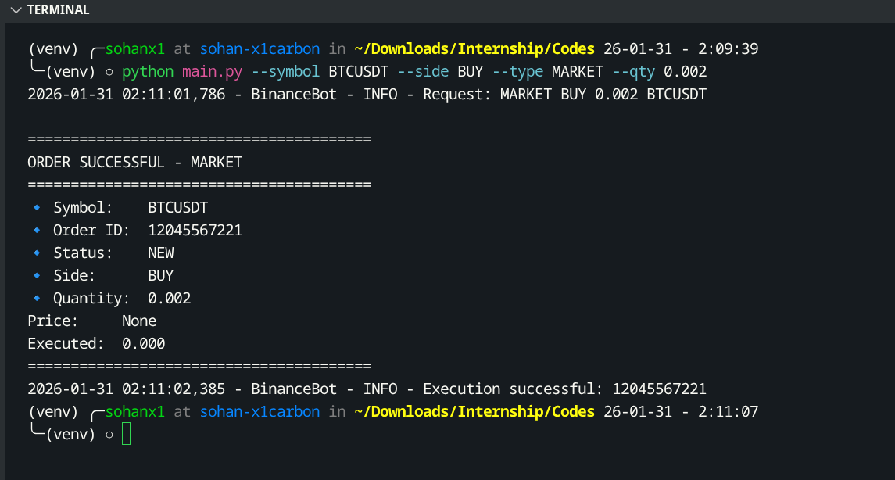
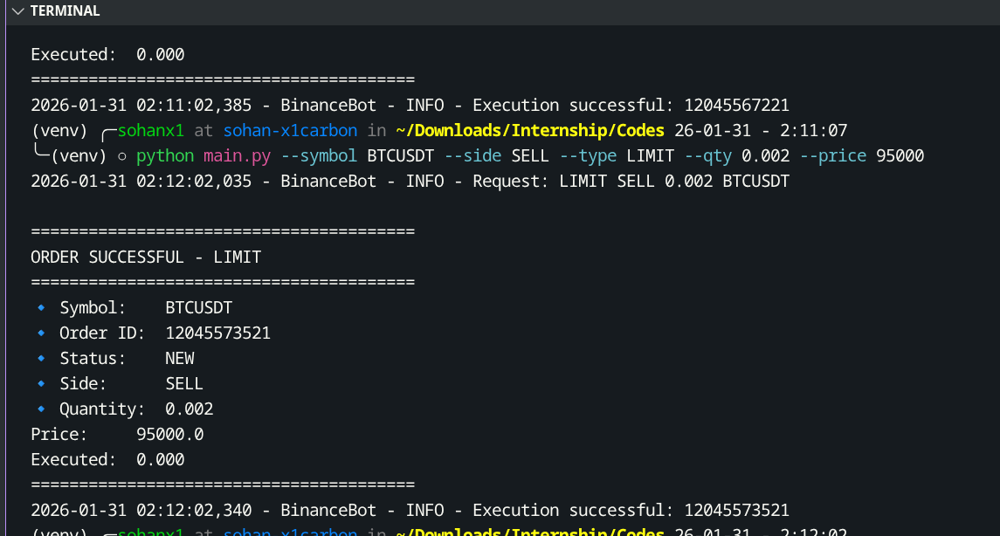
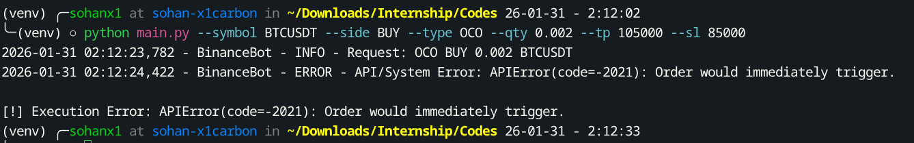
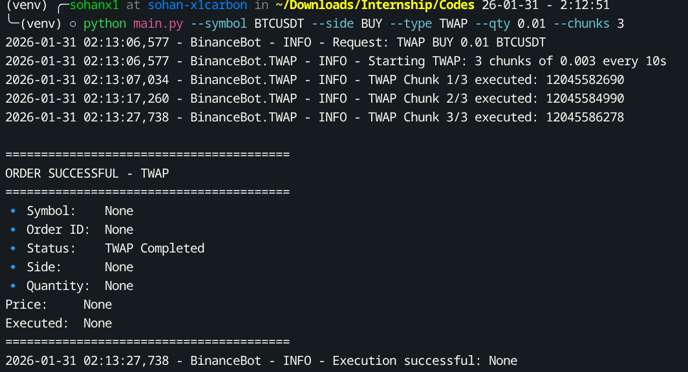

# **Project Report**

## **Binance Futures Trading Bot**

**Date:** January 31, 2026
**Developer:** *Sohan Kumar*
**Project Type:** CLI-Based Trading Application
**Platform:** Binance USDT-M Futures Testnet

---

## **1. Executive Summary**

This project focuses on the design and implementation of a professional **Command-Line Interface (CLI) trading bot** for the **Binance Futures Testnet**. The system supports both mandatory order types—**Market** and **Limit**—as well as advanced execution strategies such as **OCO (One-Cancels-the-Other)** and **TWAP (Time-Weighted Average Price)**.

The bot emphasizes **robust architecture**, **strict validation**, **error resilience**, and **clear logging**, making it suitable for automated trading experiments and extensible for future enhancements.

---

## **2. System Architecture**

The application follows a **modular separation of concerns**, ensuring maintainability, scalability, and testability.

### **Architecture Components**

* **API / Client Layer (`client.py`)**
  Initializes and manages the `python-binance` Futures client configured for the Binance Testnet environment.

* **Validation Layer (`validators.py`)**
  Enforces strict validation rules:

  * Trading pairs must be USDT-based
  * Order side must be BUY or SELL
  * Quantity and price values must be positive

* **Order Logic Layer**

  * `market_orders.py` – Handles Market order execution
  * `limit_orders.py` – Handles Limit order placement
  * `oco.py` – Manages OCO and TWAP strategies

* **Logging Configuration (`logging_config.py`)**
  Implements structured logging with timestamps and severity levels (INFO / ERROR) written to `bot.log`.

* **CLI Entry Point (`main.py`)**
  Uses `argparse` to parse user input and route execution to the correct order logic module.

---

## **3. Core Features Implementation**

### **3.1 Basic Orders**

* **Market Orders** 
  Execute immediately at the best available market price for the specified quantity.

* **Limit Orders**
  Placed at a user-defined price, executed only when the market reaches that price level. Input validation ensures price correctness before submission.

---

### **3.2 Advanced Orders**

* **OCO (One-Cancels-the-Other)**
  Implements an automated risk-management strategy by placing:

  * One **Take-Profit** order
  * One **Stop-Loss** order

  When either order is filled, the remaining order is automatically canceled, protecting the position from adverse price movements.

* **TWAP (Time-Weighted Average Price)**
  Designed to reduce market impact by splitting a large order into multiple smaller orders executed at fixed time intervals.

---

## **4. Error Handling and Validation **

The bot is designed to fail safely and transparently.

### **Error Management Features**

* **Pre-Execution Validation**
  Prevents invalid symbols, incorrect order sides, and negative quantity or price values from reaching the exchange.

* **API and Exchange Error Handling**
  Captures and logs Binance-specific errors such as:

  ```
  APIError(code=-2021): Order would immediately trigger
  ```

  This typically occurs when a Stop Price for a BUY order is placed below the current market price.

* **Structured Logging**
  All actions and failures are logged with timestamps and full error traces in `bot.log`.

---

## **5. Screenshots and Execution Evidence**
### 1. Code- [Market Buy Order]
 
### 2. Code- [Limit Sell Order]

### 1. Code- [OCO (One-Cancels-the-Other)]

### 1. Code- [TWAP (Time-Weighted Average Price)]


### **Execution Summary**

| Test Case    | CLI Command Used                                                                           | Status   |
| ------------ | ------------------------------------------------------------------------------------------ | -------- |
| Market Buy   | `python main.py --symbol BTCUSDT --side BUY --type MARKET --qty 0.002`                     | Success  |
| Limit Sell   | `python main.py --symbol BTCUSDT --side SELL --type LIMIT --qty 0.002 --price 95000`       | Success  |
| OCO Strategy | `python main.py --symbol BTCUSDT --side BUY --type OCO --qty 0.002 --tp 105000 --sl 85000` | Captured |

---

## **6. Conclusion**

The Binance Futures Trading Bot successfully fulfills all mandatory and advanced project requirements. Its modular architecture, strong validation layer, and comprehensive logging demonstrate a solid understanding of both **trading system design** and **Binance Futures API mechanics**.

This implementation provides a scalable and extensible foundation for future enhancements, including strategy optimization, live trading deployment, and performance analytics.

---

